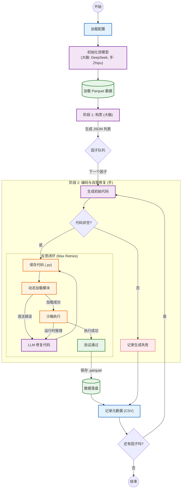

简体中文 | [English](./README.md)

# AI-Quant-Factor-Miner: Agentic 量化研究框架

## 📖 项目简介

**AI-Quant-Factor-Miner** 是一个模块化、高度可配置的 **Agentic 工作流（Agentic Workflow）** 量化研究框架。与传统的线性流程不同，它采用了 **双模型架构（Dual-LLM）** 和 **自我修复机制（Reflexion）**，实现了从“因子灵感构思”到“生产级代码生成”再到“因子数据计算”的全自动化挖掘。

本项目旨在解决量化研究中的核心痛点：

1.  **灵感枯竭 (Idea Exhaustion)**：利用 AI “大脑”进行头脑风暴，基于单一的种子想法裂变出多个差异化的因子变体。
2.  **代码低效 (Inefficient Code)**：通过精心设计的 Prompt 工程，强制 AI “写手”生成内存优化、无未来函数、高性能的 Pandas 代码。
3.  **调试复杂 (Complex Debugging)**：引入 **自我修复机制 (Reflexion)**，自动捕获报错并重试，显著提高了无人值守运行的成功率。
4.  **管理混乱 (Chaotic Management)**：实现了代码与数据存储的自动分离、带时间戳的运行隔离以及自动化的文档记录。

-----

## 🚀 核心特性 (新功能)

### 🧠 双模型架构 ("大脑" + "手")
* **逻辑解耦**：分别为 **构思 (Ideation)** 和 **编码 (Coding)** 配置不同的模型。
    * **大脑 (The Brain)**：使用擅长深度推理的模型（如 **DeepSeek R1**）来推导复杂的金融逻辑和数学公式。
    * **手 (The Hand)**：使用速度快、擅长代码生成的模型（如 **Zhipu GLM-4**, **Gemini**）来落地实现。
* **成本效益**：避免将昂贵的推理 Token 浪费在简单的语法生成上。

### 🔄 自我修复闭环 (Reflexion)
* **自动调试**：如果生成的代码执行失败（如 `SyntaxError` 或 `KeyError`），系统会自动进入 **重试闭环**。
* **上下文感知修复**：报错信息（Traceback）、原始公式和旧代码会被回传给 LLM 以生成补丁。
* **最大重试次数**：可配置重试上限，防止死循环。

### 🛡️ 工程级标准
* **内存安全**：Prompt 严格禁止在大表上使用 `pd.merge`，并强制使用向量化操作。
* **异常处理**：自动处理 `np.inf` 并标准化 `SecuCode` 格式。
* **自动重命名**：自动处理文件名冲突（例如 `Alpha_v1.py`）。
* **环境隔离**：每次运行都会生成一个带时间戳的独立目录（例如 `run_20250111_193000`），保持实验环境整洁。

-----

## 🧩 系统架构



-----

## 📂 项目目录结构

```text
QuantFactorAI/
├── config/                  # [配置中心]
│   ├── __init__.py
│   └── settings.py          # 双模型配置、路径、任务（单一事实来源）
│
├── core/                    # [LLM 逻辑层]
│   ├── __init__.py
│   ├── prompts.py           # 系统 Prompts (包含数据字典注入)
│   ├── llm_base.py          # 抽象基类
│   ├── llm_deepseek.py      # DeepSeek 实现 (大脑)
│   ├── llm_zhipu.py         # 智谱 GLM 实现 (手)
│   ├── llm_gemini.py
│
├── data_loader/             # [数据层]
│   ├── __init__.py
│   └── loader.py            # 高效读取 Parquet 数据
│
├── engine/                  # [执行引擎]
│   ├── __init__.py
│   ├── code_manager.py      # 代码清洗、正则、持久化、动态加载
│   ├── metadata_recorder.py # [新] 带时间戳的 CSV 记录器
│   └── executor.py          # 沙箱执行、数据验证、格式修正
│
├── utils/                   # [工具箱]
│   ├── __init__.py
│   └── logger.py            # 统一日志管理
│
├── main.py                  # [入口] 双模型调度器
├── requirements.txt         # 项目依赖
└── README.md                # 项目文档
```

-----

## 🛠️ 快速开始

### 1. 环境准备

确保安装了 Python 3.9 或更高版本。

```bash
# 推荐创建虚拟环境
python -m venv venv
source venv/bin/activate  # Windows: venv\Scripts\activate

# 安装依赖
pip install -r requirements.txt
```

`requirements.txt` 参考内容：
```text
pandas
numpy
zhipuai
openai
google-generativeai
pyarrow
fastparquet
```

### 2. 数据准备

本项目需要两套基础数据（Parquet 格式）：

1.  **股票日行情 (df_raw)**：长格式面板数据 (Long format Panel Data)。
2.  **指数日行情 (df_index)**：时间序列数据。

请在 `config/settings.py` 中配置您的本地路径。

### 3. 配置 API Key 与角色

打开 `config/settings.py` 并配置 **双模型** 设置：

```python
# 1. 设置 API Keys
DEEPSEEK_API_KEY = "sk-..."
ZHIPU_API_KEY = "..."

# 2. 双模型角色分配
# 大脑: 负责金融逻辑推理 (推荐 DeepSeek R1)
ACTIVE_IDEATION_PROVIDER = 'deepseek'

# 手: 负责编写 Python 代码 (推荐 Zhipu GLM-4)
ACTIVE_CODING_PROVIDER = 'zhipu'

# 3. 定义挖掘任务
FACTOR_MINING_TASKS = [
    {
        "idea": "量价背离：价格创新高但换手率下降",
        "num_variations": 3
    }
]
```

### 4. 运行程序

```bash
python main.py
```

-----

## ⚙️ 详细配置指南 (`settings.py`)

### 1. 路径与输出管理
框架会自动生成结构化、带时间戳的输出目录：
`output/structure/{Brain}_{Hand}/run_{timestamp}/`

* `codes/`：存放生成的 `.py` 代码文件（例如 `Alpha_v1.py`）。
* `factors/`：存放计算好的 `.parquet` 因子数据。
* `factor_records.csv`：执行结果汇总日志。

### 2. 数据字典定义
为了防止 AI 产生幻觉（捏造不存在的列名），我们在 Settings 中硬编码了数据列描述，并通过 Prompt 动态注入：

```python
STOCK_COLUMNS_DESC = """
'TradingDay', 'SecuCode', 'OpenPrice', 'ClosePrice', 'TurnOverRate', ...
"""
```

**注意**：如果您底层的 Parquet 数据增加了新字段（如 `VWAP`），请务必在此同步更新描述。

-----

## 🧠 设计架构细节

### 阶段 1：构思 (大脑)
* **输入**：自然语言描述的种子想法（例如“动量反转”）。
* **处理**：`ACTIVE_IDEATION_PROVIDER` (DeepSeek-Reasoner) 进行金融逻辑推理。
* **输出**：包含 `factor_formula`（公式）和 `factor_description`（描述）的结构化 JSON。

### 阶段 2：代码生成与执行 (手)
* **草稿**：`ACTIVE_CODING_PROVIDER` (Zhipu/Gemini) 编写 Python 函数。
* **约束**：
    * 严格禁止 `rolling.corr`（强制分解为 `cov / std`）。
    * 强制进行 `groupby` 操作以确保截面数据对齐。
* **动态加载**：使用 `importlib` 将字符串代码作为内存函数加载。

### 阶段 3：反思 (自愈)
* **验证**：系统检查是否出现 `SyntaxError` 或 `RuntimeError`。
* **反馈闭环**：如果出错，**Traceback（堆栈信息）** 和 **原始公式** 会被反馈给 LLM。
* **修正**：LLM 生成补丁版本的代码。此过程重复直到成功或达到 `MAX_RETRIES`。

-----

## 📊 输出示例

**1. 代码文件 (`codes/`)**
```python
# codes/VolAdjustedReversal.py
def VolAdjustedReversal(df_raw, df_index):
    # AI 生成的优化代码
    # 实现逻辑: Reversal = -1 * (Ret_20 / Std_20)
    # 自动处理 0 除错误和无穷大
    return df_final[['SecuCode', 'TradingDay', 'VolAdjustedReversal']]
```

**2. 因子汇总表 (`factor_records_2025xxxx.csv`)**

| Timestamp | Provider | Seed_Idea | Factor_Name | Status | Code_Path |
| :--- | :--- | :--- | :--- | :--- | :--- |
| 2025-02-23 | zhipu | 量价背离 | HighPriceVolDivergence | **Success** | output/.../HighPrice.py |
| 2025-02-23 | zhipu | 简单动量 | SimpleMom | **Fail** | Deleted |

-----

## ❓ 常见问题排查 (Troubleshooting)

**Q: 运行报错 `ImportError: attempted relative import...`**
A: 请确保您是在项目根目录下运行 `python main.py`，不要进入子文件夹直接运行脚本。

**Q: Zhipu/DeepSeek 提示 `Connection error`？**
A: 检查您的代理设置。如果您在中国大陆，这些 API 通常需要直连或特定的代理规则。尝试在 `main.py` 顶部添加 `os.environ.pop("http_proxy", None)`。

**Q: Mermaid 流程图无法显示？**
A: GitHub 网页端的渲染器有时不支持复杂的样式。您可以在 VS Code 中安装 "Markdown Preview Mermaid Support" 插件来查看。

-----

**免责声明**：量化投资有风险。本框架仅供研究和教育目的，不构成任何投资建议。