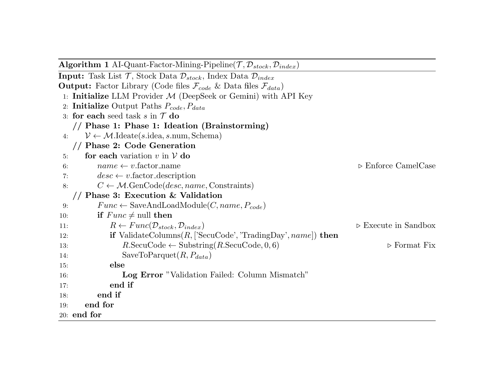

[简体中文](./readme(CH).md) | English

# AI-Quant-Factor-Miner: LLM-Based Automated Factor Mining Framework

## 📖 Project Introduction

**AI-Quant-Factor-Miner** is a modular, highly configurable quantitative finance research framework. It leverages advanced Large Language Models (LLMs), such as **DeepSeek (R1)** and **Google Gemini (Pro/Flash)**, to implement a fully automated pipeline from "Factor Idea Conception" to "Production-Grade Code Generation" and finally "Factor Data Calculation".

This framework aims to solve key pain points in quantitative research:

1.  **Idea Exhaustion**: Using AI brainstorming to fissure multiple differentiated variants based on a single seed idea.
2.  **Inefficient Code**: Enforcing AI to generate memory-optimized, look-ahead bias-free, high-performance Pandas code through carefully designed Prompt Engineering.
3.  **Chaotic Management**: Implementing automated separation of code and data storage, supporting multi-model comparison testing.

-----

## 🚀 Core Features

* **Multi-LLM Strategy**:
    * Seamless switching between **DeepSeek** (excels in deep reasoning/math logic) and **Gemini** (excels in long context/fast generation).
    * Designed using the Strategy Pattern; extending a new model only requires adding a subclass.
* **Engineering-Grade Code Generation**:
    * Enforces **CamelCase** naming conventions.
    * Built-in memory optimization standards: Prohibits large table Merges, prohibits `rolling.corr` (enforces use of `cov/std` decomposition formulas).
    * Automatically handles `np.inf` outliers and SecuCode formatting.
* **Sandbox Execution Environment**:
    * Dynamically loads generated Python code without restarting the main program.
    * Strict data validation mechanisms ensure uniform output DataFrame formats.
* **Structured Output**:
    * Automatically routes output paths based on the model used (e.g., `output/deepseek/factors` vs `output/gemini/factors`).
    * Physical separation of code files (`.py`) and data files (`.parquet`).

-----

## 📂 Project Directory Structure

~~~text
QuantFactorAI/
├── config/                  # [Configuration Center]
│   ├── __init__.py
│   └── settings.py          # Global Config: Keys, Paths, Task List (Single Source of Truth)
│
├── core/                    # [Core Logic]
│   ├── __init__.py
│   ├── prompts.py           # Carefully tuned System Prompts (includes Data Dictionary injection)
│   ├── llm_base.py          # LLM Abstract Base Class
│   ├── llm_deepseek.py      # DeepSeek Interface Implementation
│   ├── llm_gemini.py        # Gemini Interface Implementation
│
├── data_loader/             # [Data Layer]
│   ├── __init__.py
│   └── loader.py            # Efficiently reads Parquet data, constructs Data Bundle
│
├── engine/                  # [Execution Engine]
│   ├── __init__.py
│   ├── code_manager.py      # Code cleaning, persistence, and dynamic module loading
│   └── executor.py          # Factor function execution, result validation, format correction (SecuCode truncation)
│
├── utils/                   # [Toolbox]
│   ├── __init__.py
│   └── logger.py            # Unified logging management
│
├── main.py                  # [Entry] Main program for task scheduling
├── requirements.txt         # Project dependencies
└── README.md                # Project documentation
~~~

-----

## 🛠️ Quick Start

### 1. Environment Preparation

Ensure Python 3.9 or higher is installed.

~~~bash
# Recommend creating a virtual environment
python -m venv venv
source venv/bin/activate  # Windows: venv\Scripts\activate

# Install dependencies
pip install -r requirements.txt
~~~

`requirements.txt` reference content:

~~~text
pandas
numpy
openai
google-generativeai
pyarrow
fastparquet
~~~

### 2. Data Preparation

This project requires two sets of base data (Parquet format):

1.  **Stock Daily Market Data (df_raw)**: Long format Panel Data.
2.  **Index Daily Market Data (df_index)**: Time-series Data.

Please configure your local paths in `config/settings.py`.

### 3. Configure API Key and Tasks

Open `config/settings.py` and complete the following three steps:

1.  **Set API Key** (Recommend using environment variables, or fill in directly):
    ~~~python
    DEEPSEEK_API_KEY = os.getenv("DEEPSEEK_API_KEY", "your-sk-key")
    ~~~
2.  **Select Model**:
    ~~~python
    ACTIVE_PROVIDER = 'deepseek'  # or 'gemini'
    ~~~
3.  **Define Mining Tasks**:
    ~~~python
    FACTOR_MINING_TASKS = [
        {
            "idea": "Price-Volume Divergence: Price hits new high but turnover rate decreases",
            "num_variations": 3
        }
    ]
    ~~~

### 4. Run Program

~~~bash
python main.py
~~~

-----

## ⚙️ Detailed Configuration Guide (`settings.py`)

`config/settings.py` is the framework's **Single Source of Truth**.

### 1. Path Management

The framework automatically generates output directories based on `ACTIVE_PROVIDER`, no manual folder creation required:

* If using DeepSeek: `BASE_OUTPUT_DIR/deepseek/codes/`
* If using Gemini: `BASE_OUTPUT_DIR/gemini/codes/`

### 2. Data Dictionary Definition

To prevent AI hallucinations (fabricating non-existent columns), we hardcode data column descriptions in Settings and dynamically inject them into the AI via Prompts:

~~~python
STOCK_COLUMNS_DESC = """
'TradingDay', 'SecuCode', 'OpenPrice', 'ClosePrice', 'TurnOverRate', ...
"""
~~~

**Note**: If your underlying Parquet data adds new fields (e.g., `VWAP`), strictly update the description here synchronously.

### 3. Task List

You can batch define tasks in the `FACTOR_MINING_TASKS` list.

* `idea`: Natural language description of the base factor.
* `num_variations`: How many variations you want the AI to generate based on this idea (default is 3).

-----

## 🧠 Design Architecture Details

### Phase 1: Ideation

* **Input**: Seed idea in natural language description (e.g., "Momentum Reversal").
* **Processing**: LLM (DeepSeek-Reasoner / Gemini-Flash) performs financial logic reasoning.
* **Prompt Constraints**:
    * Enforces **JSON** format output.
    * Enforces **CamelCase** naming.
    * Requires mathematical logic differentiation, not simple parameter modification.

### Phase 2: Code Generation

* **Input**: Factor name and specific calculation logic.
* **Processing**: LLM (DeepSeek-Chat / Gemini-Flash) writes Python functions.
* **Performance Constraints**:
    * **Memory Safety**: Strictly prohibits `pd.merge` on large tables; must calculate on small tables before merging.
    * **Calculation Optimization**: Strictly prohibits `rolling.corr`; enforces decomposition into `cov / (std*std)`.
    * **Data Alignment**: Enforces operations after `groupby`, enforces `reset_index`.

### Phase 3: Execution and Cleaning

* **Dynamic Loading**: Uses `importlib` to load generated string code as in-memory functions.
* **Post-processing**:
    * `SecuCode` strictly truncated to 6-digit strings (fixes `.SZ/.SH` suffixes or Int type issues).
    * Validates whether the DataFrame contains `SecuCode`, `TradingDay`, and `FactorValue`.

-----

## 📊 Output Example

After execution, the `output/deepseek/` directory will generate:

**1. Code Files (`codes/`)**

~~~python
# codes/VolAdjustedReversal.py
import pandas as pd
import numpy as np

def VolAdjustedReversal(df_raw, df_index):
    # Math Formula: Reversal = -1 * (Ret_20 / Std_20)
    # Logic: 20-day reversal factor adjusted by volatility
    
    # ... (AI generated optimized code) ...
    return df_final[['SecuCode', 'TradingDay', 'VolAdjustedReversal']]
~~~

**2. Factor Data (`factors/`)**
`VolAdjustedReversal.parquet` (Standard DataFrame format, ready for backtesting database).

-----

## ❓ Troubleshooting

**Q: Error `ImportError: attempted relative import...`**
A: Please ensure you run `python main.py` in the project root directory, do not run scripts directly inside subfolders.

**Q: AI generated code raises `KeyError`**
A: Check if `STOCK_COLUMNS_DESC` in `settings.py` is exactly consistent with the actual column names in your local Parquet files.

**Q: Prompt `Authentication Fails`**
A: Please enter the correct API Key in `config/settings.py`.

-----
## 🧬 Algorithm Flow

-----

**Disclaimer**: Quantitative investment involves risks. This framework is for research purposes only.