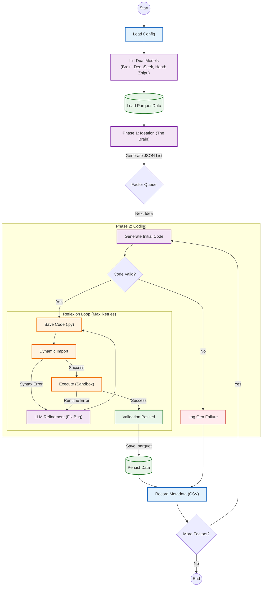

[简体中文](./readme(CH).md) | English

# AI-Quant-Factor-Miner: Agentic Quant Research Framework

## 📖 Project Introduction

**AI-Quant-Factor-Miner** is a modular, highly configurable, **Agentic Workflow** quantitative research framework. It leverages advanced Large Language Models (LLMs), such as **DeepSeek (R1)** and **Zhipu GLM-4 / Gemini**, to implement a fully automated pipeline from "Factor Idea Conception" to "Production-Grade Code Generation" and finally "Factor Data Calculation".

This framework aims to solve key pain points in quantitative research:

1.  **Idea Exhaustion**: Using AI brainstorming (The Brain) to fissure multiple differentiated variants based on a single seed idea.
2.  **Inefficient Code**: Enforcing AI (The Hand) to generate memory-optimized, look-ahead bias-free, high-performance Pandas code through carefully designed Prompt Engineering.
3.  **Complex Debugging**: Introduces a **Self-Correction Mechanism (Reflexion)** that automatically captures errors and retries, significantly increasing the success rate of unmanned runs.
4.  **Chaotic Management**: Implementing automated separation of code and data storage, timestamped run isolation, and automated documentation.

-----

## 🚀 Core Features

### 🧠 Dual-Model Architecture ("Brain" + "Hand")
* **Decoupled Logic**: Configure different models for **Ideation** and **Coding**.
    * **The Brain (Ideation)**: Uses reasoning-heavy models (e.g., **DeepSeek R1**) to deduce complex financial logic and formulas.
    * **The Hand (Coding)**: Uses fast, coding-optimized models (e.g., **Zhipu GLM-4**, **Gemini**) for implementation.
* **Cost Efficiency**: Optimization by not wasting expensive reasoning tokens on simple syntax generation.

### 🔄 Self-Correction Loop (Reflexion)
* **Automatic Debugging**: If the generated code fails (e.g., `SyntaxError` or `KeyError`), the system enters a **Retry Loop**.
* **Context-Aware Fixes**: The error message, original formula, and old code are sent back to the LLM to generate a patch.
* **Max Retries**: Configurable retry limits to prevent infinite loops.

### 🛡️ Engineering-Grade Standards
* **Memory Safety**: Prompts strictly prohibit `pd.merge` on large tables and enforce vectorized operations.
* **Outlier Handling**: Automatically handles `np.inf` and standardized `SecuCode` formatting.
* **Automated Renaming**: Handles file naming collisions (e.g., `Alpha_v1.py`) automatically.

-----

## 🧩 System Architecture



-----

## 📂 Project Directory Structure

```text
QuantFactorAI/
├── config/                  # [Configuration Center]
│   ├── __init__.py
│   └── settings.py          # Dual-Model Config, Paths, Tasks (Single Source of Truth)
│
├── core/                    # [LLM Logic Layer]
│   ├── __init__.py
│   ├── prompts.py           # System Prompts (Data Dictionary Injection)
│   ├── llm_base.py          # Abstract Base Class
│   ├── llm_deepseek.py      # DeepSeek Implementation (Brain)
│   ├── llm_zhipu.py         # Zhipu GLM Implementation (Hand)
│   ├── llm_qwen.py
│   └── llm_kimi.py
│
├── data_loader/             # [Data Layer]
│   ├── __init__.py
│   └── loader.py            # Efficiently reads Parquet data
│
├── engine/                  # [Execution Engine]
│   ├── __init__.py
│   ├── code_manager.py      # Code cleaning, Regex, Persistence, Dynamic Loading
│   ├── metadata_recorder.py # [New] Timestamped CSV Recorder
│   └── executor.py          # Sandbox execution, validation, formatting
│
├── utils/                   # [Toolbox]
│   ├── __init__.py
│   └── logger.py            # Unified logging
│
├── main.py                  # [Entry] Dual-Model Orchestrator
├── requirements.txt         # Project dependencies
└── README.md                # Project documentation
```

-----

## 🛠️ Quick Start

### 1. Environment Preparation

Ensure Python 3.9 or higher is installed.

```bash
# Recommend creating a virtual environment
python -m venv venv
source venv/bin/activate  # Windows: venv\Scripts\activate

# Install dependencies
pip install -r requirements.txt
```

`requirements.txt` reference:
```text
pandas
numpy
zhipuai
openai
google-generativeai
pyarrow
fastparquet
```

### 2. Data Preparation

This project requires two sets of base data (Parquet format):

1.  **Stock Daily Market Data (df_raw)**: Long format Panel Data.
2.  **Index Daily Market Data (df_index)**: Time-series Data.

Please configure your local paths in `config/settings.py`.

### 3. Configure API Keys and Roles

Open `config/settings.py` and configure the **Dual-Model** setup:

```python
# 1. Set API Keys
DEEPSEEK_API_KEY = "sk-..."
ZHIPU_API_KEY = "..."

# 2. Dual-Model Role Assignment
# The Brain: Responsible for financial logic (DeepSeek R1)
ACTIVE_IDEATION_PROVIDER = 'deepseek'

# The Hand: Responsible for writing Python code (Zhipu GLM-4)
ACTIVE_CODING_PROVIDER = 'zhipu'

# 3. Define Mining Tasks
FACTOR_MINING_TASKS = [
    {
        "idea": "Price-Volume Divergence: Price hits new high but turnover rate decreases",
        "num_variations": 3
    }
]
```

### 4. Run Program

```bash
python main.py
```

-----

## ⚙️ Detailed Configuration Guide (`settings.py`)

### 1. Path & Output Management
The framework automatically generates structured, timestamped output directories:
`output/structure/{Brain}_{Hand}/run_{timestamp}/`

* `codes/`: Contains generated `.py` files (e.g., `Alpha_v1.py`).
* `factors/`: Contains calculated `.parquet` data files.
* `factor_records.csv`: Execution log summary.

### 2. Data Dictionary Definition
To prevent AI hallucinations (fabricating non-existent columns), we hardcode data column descriptions in Settings and dynamically inject them via Prompts:

```python
STOCK_COLUMNS_DESC = """
'TradingDay', 'SecuCode', 'OpenPrice', 'ClosePrice', 'TurnOverRate', ...
"""
```

**Note**: If your underlying Parquet data adds new fields (e.g., `VWAP`), strictly update the description here synchronously.

-----

## 🧠 Design Architecture Details

### Phase 1: Ideation (The Brain)
* **Input**: Seed idea in natural language (e.g., "Momentum Reversal").
* **Processing**: `ACTIVE_IDEATION_PROVIDER` (DeepSeek-Reasoner) performs financial logic reasoning.
* **Output**: Structured JSON containing `factor_formula` and `factor_description`.

### Phase 2: Code Generation & Execution (The Hand)
* **Drafting**: `ACTIVE_CODING_PROVIDER` (Zhipu/Gemini) writes Python functions.
* **Constraints**:
    * Strictly prohibits `rolling.corr` (enforces decomposition into `cov / std`).
    * Enforces `groupby` operations for cross-sectional alignment.
* **Dynamic Loading**: Uses `importlib` to load string code as in-memory functions.

### Phase 3: Reflexion (Self-Healing)
* **Validation**: The system checks for `SyntaxError` or `RuntimeError`.
* **Feedback Loop**: If an error occurs, the **Traceback** and **Original Formula** are fed back to the LLM.
* **Correction**: The LLM generates a patched version of the code. This repeats until success or `MAX_RETRIES`.

-----

## 📊 Output Example

**1. Code Files (`codes/`)**
```python
# codes/VolAdjustedReversal.py
def VolAdjustedReversal(df_raw, df_index):
    # AI generated optimized code
    # Implements: Reversal = -1 * (Ret_20 / Std_20)
    # Automatically handles 0 division and infinity
    return df_final[['SecuCode', 'TradingDay', 'VolAdjustedReversal']]
```

**2. Factor Summary Table (`factor_records_2025xxxx.csv`)**

| Timestamp | Provider | Seed_Idea | Factor_Name | Status | Code_Path |
| :--- | :--- | :--- | :--- | :--- | :--- |
| 2025-02-23 | zhipu | Price-Vol Divergence | HighPriceVolDivergence | **Success** | output/.../HighPrice.py |
| 2025-02-23 | zhipu | Momentum | SimpleMom | **Fail** | Deleted |

-----

## ❓ Troubleshooting

**Q: Error `ImportError: attempted relative import...`**
A: Please ensure you run `python main.py` in the project root directory, do not run scripts directly inside subfolders.

**Q: `Connection error` with Zhipu/DeepSeek?**
A: Check your proxy settings. Try adding `os.environ.pop("http_proxy", None)` to the top of `main.py` if you are in China.

**Q: The Mermaid diagram doesn't render?**
A: GitHub's native renderer might struggle with complex styles. You can view the diagram in VS Code using the "Markdown Preview Mermaid Support" extension.

-----

**Disclaimer**: Quantitative investment involves risks. This framework is for research purposes only.